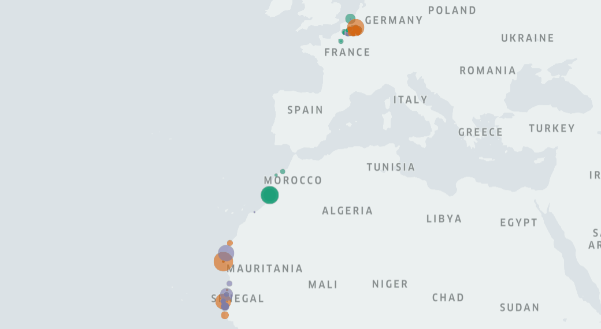
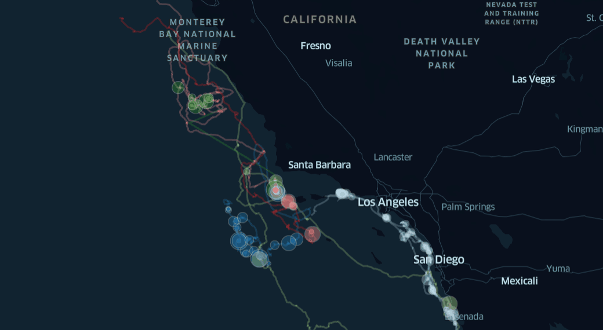
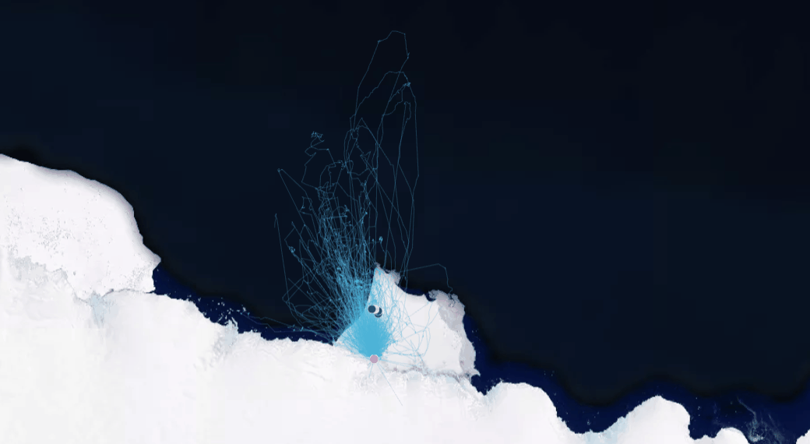
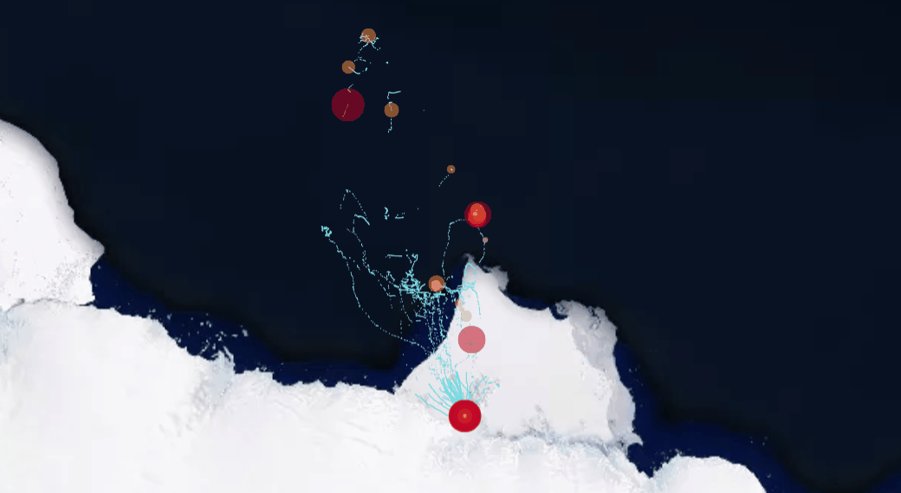
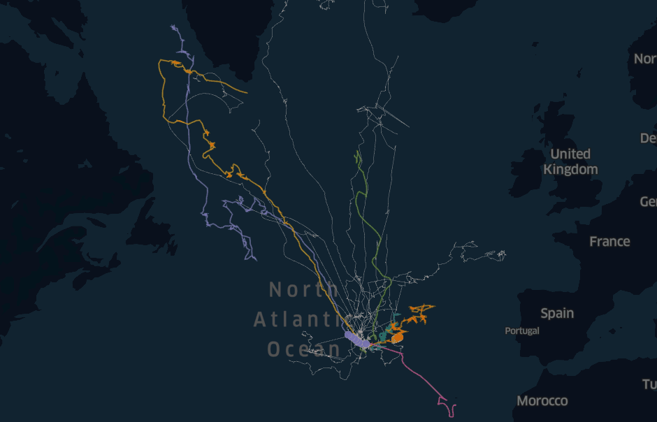
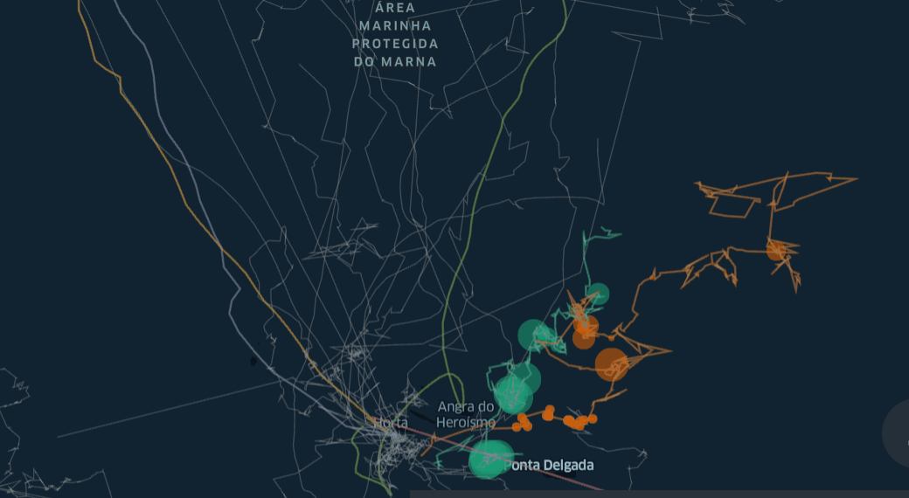

# Wildlife Tracker - Real time movement analytics

## Introduction
Thanks to the advances in data streaming and tracking technologies the **Wildlife Tracker** is software capable of revealing animal behavior in **real-time visibility.**
This software is capable of real-time geo-visualization and its development includes movement analytic's algorithms that can reveal the behavior of wildlife. In the first release, the software includes real-time data streaming and animal behavior analytics as Open Source. It means that institutions dedicated to Nature Conservation will be able to implement the software in their projects for free.

[Wildlife Tracker Presentation]()

[Wildlife Tracker Website]()

# Demos
## Nesting behavior in Bird's migration routes
[DEMO HERE](https://gis-move-analytics.github.io/wildlife-tracker/root/birds-demo.html)

## Foraging spots detection in Blue Whales behavior
[DEMO HERE](https://gis-move-analytics.github.io/wildlife-tracker/root/whales-demo.html)

## Movements of Adélie penguins
[DEMO HERE](https://gis-move-analytics.github.io/wildlife-tracker/root/moves-penguins-demo.html)

## Foraging behavior of Adélie penguins
[DEMO HERE](https://gis-move-analytics.github.io/wildlife-tracker/root/foraging-penguins-demo.html)

## Great Whale's migration routes
[DEMO HERE](https://gis-move-analytics.github.io/wildlife-tracker/root/azores-demo.html)

## Great Whale's migration routes II Foraging Spots
[DEMO HERE](https://gis-move-analytics.github.io/wildlife-tracker/root/azores-II-demo.html)

