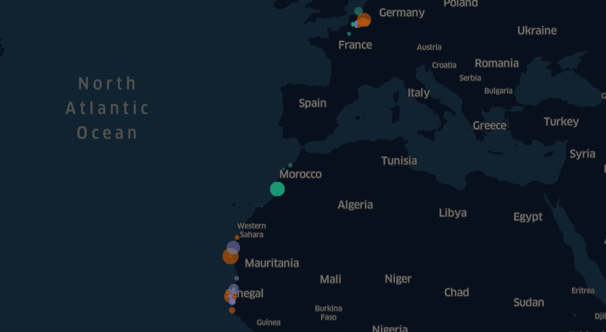
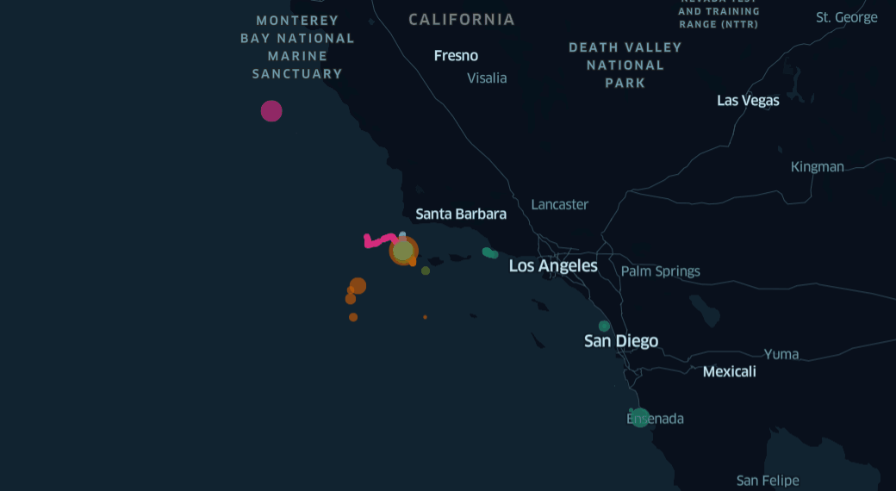
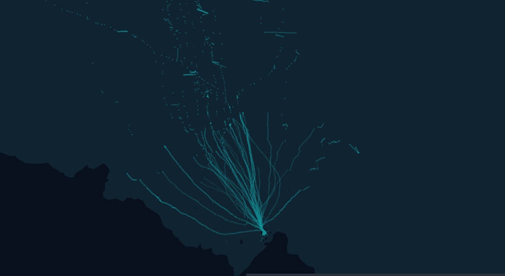

# Wildlife Tracker - Demos

## Introduction
Thanks to the advances in data streaming and tracking technologies the **Wildlife Tracker** is software capable of revealing animal behavior in **real-time visibility**
This software is capable of real-time geo-visualization and its development includes movement analytic's algorithms that can reveal the behavior of wildlife. In the first release, the software includes real-time data streaming and animal behavior analytics as Open Source. It means that institutions dedicated to Nature Conservation will be able to implement the software in their projects for free.

[Introductory article of Wildlife Tracker]()
[Wildlife Tracker Website]()

# Demos
## Nesting behavior in Bird's migration routes
[DEMO HERE]()

## Feeding spots detection in Blue Whales behavior
[DEMO HERE]()

## Foraging behavior of Adélie penguins
[DEMO HERE]()

